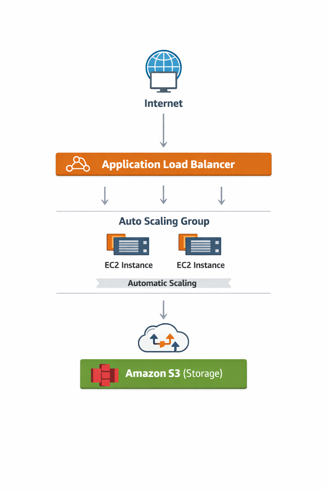
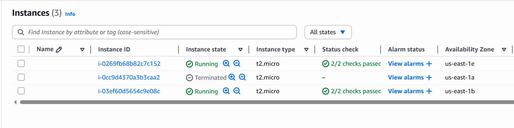
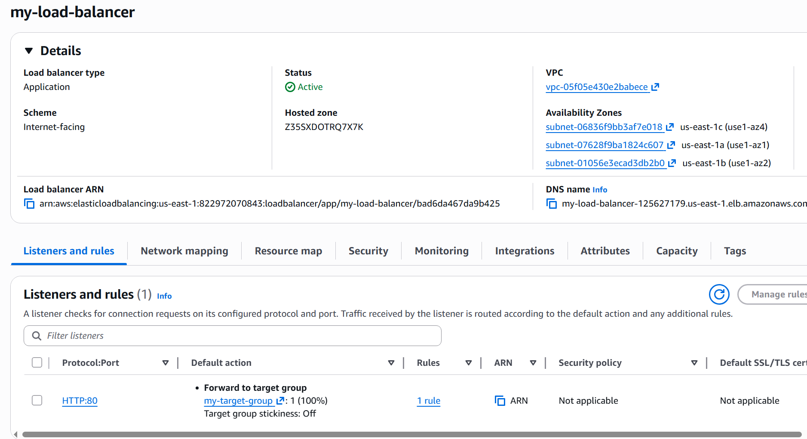
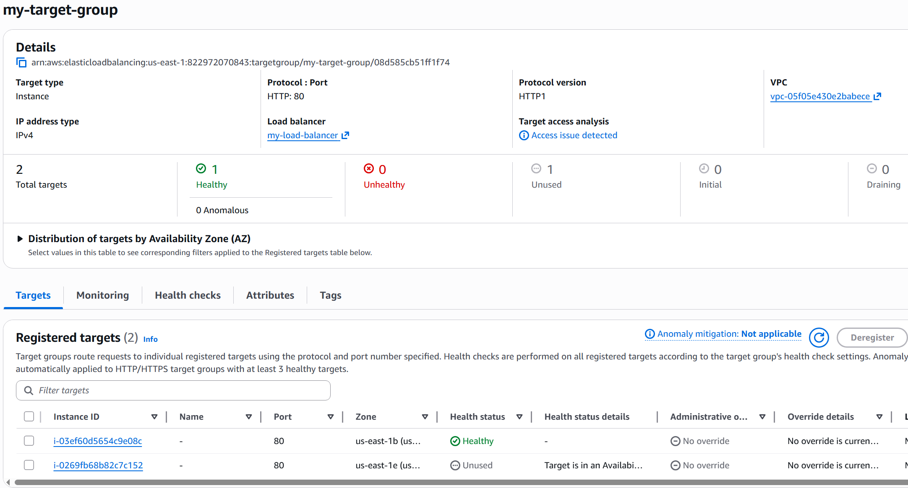
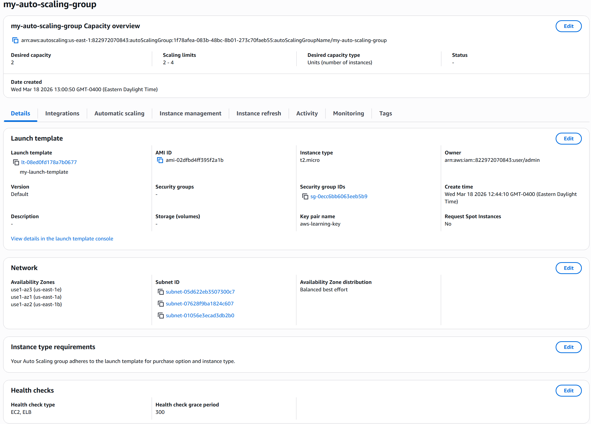
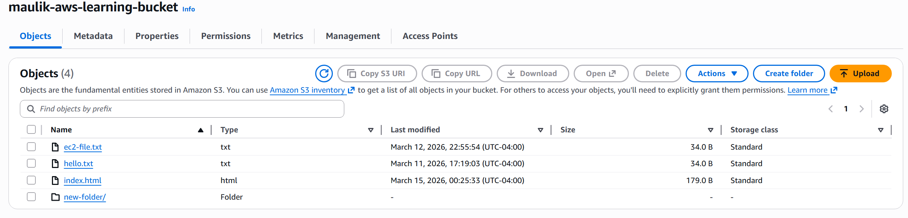
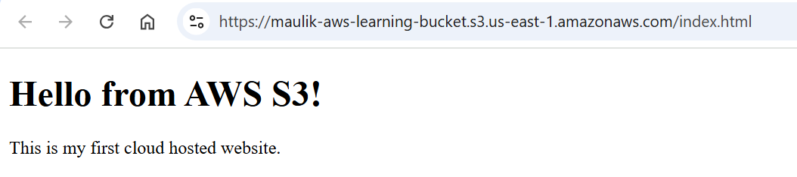

# aws-cloud-architecture-project
AWS Scalable Cloud Architecture Project

## 📌 Overview
This project demonstrates the design and deployment of a highly available and scalable cloud architecture on AWS. It showcases core cloud engineering concepts including compute, storage, networking, load balancing, and auto scaling.

---

## 🏗 Architecture

---

## ⚙️ AWS Services Used

- Amazon EC2 – Virtual servers for hosting web applications  
- Amazon S3 – Object storage for files and static website hosting  
- Elastic Load Balancing (Application Load Balancer) – Distributes traffic across instances  
- EC2 Auto Scaling – Automatically scales instances based on demand  
- IAM – Secure role-based access between services  
- VPC – Networking layer with subnets and security groups  
- CloudWatch – Monitoring and alerting  

---

## 🔥 Features Implemented

- ✅ Deployed EC2 instances with Nginx web server  
- ✅ Configured Application Load Balancer for traffic distribution  
- ✅ Implemented Auto Scaling Group for dynamic scaling  
- ✅ Enabled high availability across multiple Availability Zones  
- ✅ Hosted a static website using S3  
- ✅ Configured IAM roles for secure EC2 → S3 communication  
- ✅ Set up CloudWatch alarms for monitoring  
- ✅ Configured security groups for controlled access  

---

## 🧪 Key Experiments & Testing

- Verified load balancing by serving different responses from multiple EC2 instances  
- Simulated failure by stopping an instance and confirming traffic rerouting  
- Tested scaling by increasing desired capacity in Auto Scaling Group  
- Validated S3 uploads from EC2 using IAM roles  

---

## 🌐 Live Demo
Live Demo: http://my-load-balancer-125627179.us-east-1.elb.amazonaws.com/

---

## 📸 Screenshots

- EC2 instances running
- Load balancer configuration  
- Target group health checks (healthy)  
- Auto Scaling group activity  
- S3 bucket contents  
- Website output in browser  

---

## 📚 What I Learned

- Designing scalable and fault-tolerant cloud architectures  
- Managing EC2 instances and networking within a VPC  
- Implementing load balancing and auto scaling strategies  
- Securing AWS resources using IAM roles and policies  
- Monitoring infrastructure using CloudWatch  
- Debugging real-world cloud issues (e.g., 503 errors, health checks)  

---

## 🚧 Challenges Faced

- Resolved 503 errors caused by load balancer health checks and AZ configuration  
- Debugged security group misconfigurations affecting HTTP traffic  
- Understood importance of multi-AZ deployment for high availability  

---

## 📈 Future Improvements

- Add a backend API (Node.js / Python)  
- Integrate a database (RDS or DynamoDB)  
- Use CloudFront for CDN and caching  
- Add CI/CD pipeline for automated deployments  
- Implement Infrastructure as Code (Terraform or CloudFormation)  

---

## 💼 Resume Impact

This project demonstrates hands-on experience with real-world AWS architecture patterns including high availability, scalability, and secure cloud design.

